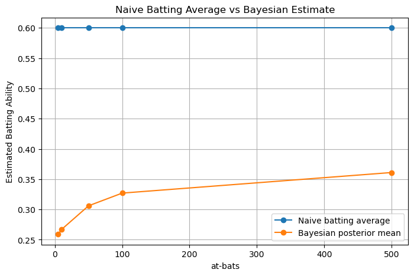

# Bayesian Batting Average Estimation

This project explores how Bayseian statistics can be applied to estimate a baseball player's true batting ability.

A normal batting average can overreact to small samples. For example, a player hitting 6/10 has the same observed average as one hitting 600/1000. The latter is obviously stronger evidence, hence the latter is a better hitter.

For this project, I used a Beta-Binomial model to compare the traditional naieve batting average with Bayesian posterior estimates.

## Research Question

How does Bayseian estimation handle small-sample batting averages comapred with naive batting average?

### Research Motivation

I've played almost all of my teams baseball games this season and as one of the stronge hitters on the team, my traditional, naive batting average is quite strong. However, looking to make a push for a promotion next season I saw an oppurtunity to combine my love for baseball with my love of statistics and applied mathematics. So, the goal was obvious: prove mathematically I am a stronger hitter than some of the members of my team whose averages are currently greater than mine.

## Current Version

 - Implement Beta-Binomial updating
 - Compare small and large sample sizes
 - Plot prior and posterior distributions
 - Computer posterior means and credible intervals

## Current results

### Experiment 1

The first experiment compares players with the same observed batting average (0.600) but different sample sizes.

The Bayesian model distinguishes between small and large samples:

- small samples are strongly shrunk toward the prior
- large samples are trusted more
- uncertainty decreases as at-bats increases

This shows why naive batting average can be misleading early in a season or over a small number of at-bats.

